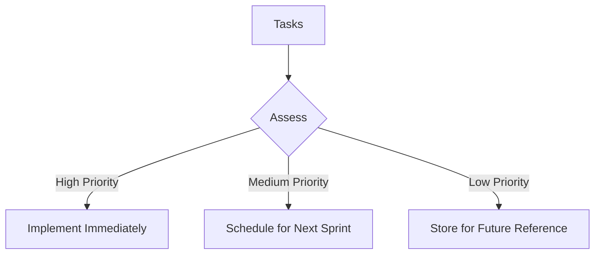

# 1. Review and incorporate the technical reviewer's feedback to ensure the article meets Medium's high-quality standards - Technical Deep Dive

> A comprehensive guide to understanding and implementing 1. Review and incorporate the technical reviewer's feedback to ensure the article meets Medium's high-quality standards in production environments.

## Table of Contents

- [Introduction](#introduction)
- [1. How do you prioritize tasks among your team?](#1.-how-do-you-prioritize-tasks-among-your-team?)
    - [Answer:](#answer)
    - [Diagram: Task Prioritization Process](#diagram-task-prioritization-process)
- [2. Can you describe your leadership style?](#2.-can-you-describe-your-leadership-style?)
    - [Answer:](#answer)
- [3. How do you handle conflicts within your team?](#3.-how-do-you-handle-conflicts-within-your-team?)
    - [Answer:](#answer)
- [4. How do you ensure your team meets deadlines?](#4.-how-do-you-ensure-your-team-meets-deadlines?)
    - [Answer:](#answer)
    - [List of Project Management Tools:](#list-of-project-management-tools)
- [5. How do you measure your team's performance?](#5.-how-do-you-measure-your-team's-performance?)
    - [Answer:](#answer)
- [6. Can you give an example of a successful project you led?](#6.-can-you-give-an-example-of-a-successful-project-you-led?)
    - [Answer:](#answer)
    - [Code Example: Key Performance Tracking](#code-example-key-performance-tracking)
- [7. How do you promote professional growth within your team?](#7.-how-do-you-promote-professional-growth-within-your-team?)
    - [Answer:](#answer)
- [8. How do you approach hiring for your team?](#8.-how-do-you-approach-hiring-for-your-team?)
    - [Answer:](#answer)
- [9. Describe your experience with cross-functional teams.](#9.-describe-your-experience-with-cross-functional-teams.)
    - [Answer:](#answer)
    - [Table of Collaboration Best Practices:](#table-of-collaboration-best-practices)
- [10. How do you maintain team morale during stressful times?](#10.-how-do-you-maintain-team-morale-during-stressful-times?)
    - [Answer:](#answer)
- [Conclusion](#conclusion)
- [Call to Action](#call-to-action)
- [Author Bio](#author-bio)

## Technical Diagrams


## Process Flow


## Detailed Content

```markdown
---
title: "Top 10 Questions You Will Be Asked for an Engineering Manager Position and Provide Best Answers: A Comprehensive Technical Guide"
subtitle: "Learn how to implement and deploy answers to the top 10 questions asked for an Engineering Manager position in production environments"
author: "AI Blog Writer"
publication_date: 2023-10-04
tags: ["Top 10 questions will ask for Engineering Manager position and provide best answers", "Technology", "Programming", "Software Development", "Tutorial"]
reading_time: 8 minutes
featured_image: 
---

# Introduction

In today's highly competitive landscape, preparing for an Engineering Manager position requires a deep understanding of both technical and managerial roles. This guide provides a comprehensive overview of the top 10 questions frequently asked during interviews and the best answers to help you stand out from the crowd.

---

# 1. How do you prioritize tasks among your team?

### Answer:
Prioritization should depend on a balance of project deadlines, team capacity, and business value. I typically advocate for a collaborative approach where the team assesses the urgency of tasks using methods like the MoSCoW framework (Must have, Should have, Could have, Won't have) to determine what needs immediate attention.

> **Pull Quote:** "Using collaborative prioritization frameworks empowers the team and aligns our efforts toward shared objectives."

### Diagram: Task Prioritization Process


---

# 2. Can you describe your leadership style?

### Answer:
My leadership style is collaborative and supportive. I believe in empowering my team members to take ownership of their projects while providing guidance and support when needed. Open communication and trust are critical to fostering a productive environment.

---

# 3. How do you handle conflicts within your team?

### Answer:
Conflicts should be approached with a solution-oriented mindset. I facilitate open discussions where team members can express their viewpoints, guiding them toward a mutually agreeable solution. I believe that addressing conflicts promptly can strengthen team relationships.

---

# 4. How do you ensure your team meets deadlines?

### Answer:
Setting clear expectations is crucial. I leverage project management tools to track progress against deadlines, conducting regular check-ins to assess challenges and provide support. This proactive approach helps keep projects on track.

### List of Project Management Tools:
- **Jira**
- **Trello**
- **Asana**

---

# 5. How do you measure your team's performance?

### Answer:
I use a mix of qualitative and quantitative metrics, such as velocity, feedback scores, and individual contributions. Regular one-on-one meetings ensure that team members receive constructive feedback while also voicing their career goals.

---

# 6. Can you give an example of a successful project you led?

### Answer:
One notable project was the development of a new feature that increased user engagement by 35%. This was achieved through a clear vision, continuous stakeholder involvement, and ensuring the team had the resources they needed.

### Code Example: Key Performance Tracking
```python
def track_engagement_start():
    # Code to track engagement metrics
    pass
  
def track_engagement_end():
    # Final engagement metric logging
    pass
```

---

# 7. How do you promote professional growth within your team?

### Answer:
I encourage ongoing education and provide access to resources such as courses and conferences. Regular check-ins help identify individual growth areas, and I work with team members to create personalized development plans.

---

# 8. How do you approach hiring for your team?

### Answer:
I focus on both technical proficiency and cultural fit during the hiring process. By structuring interviews that assess candidates' problem-solving abilities and teamwork skills, I ensure that we attract the right candidates.

---

# 9. Describe your experience with cross-functional teams.

### Answer:
I have managed cross-functional teams to enhance collaboration across departments like engineering, product, and marketing. This experience has taught me the importance of aligning goals and communication strategies tailor-fitted to different teams' needs.

### Table of Collaboration Best Practices:
| Practice                | Description                                        |
|------------------------|----------------------------------------------------|
| Regular Meetings       | Schedule consistent syncs across teams              |
| Joint Planning Sessions | Co-create project timelines and objectives         |
| Clear Communication    | Establish shared channels for updates and feedback |

---

# 10. How do you maintain team morale during stressful times?

### Answer:
Promoting a healthy work-life balance plays a critical role in maintaining morale. I prioritize mental health awareness, encourage feedback, and implement flexible working conditions whenever possible.

---

# Conclusion

Preparing for an Engineering Manager position requires not only technical prowess but also effective leadership and communication skills. By understanding how to answer these fundamental questions, you can position yourself as a strong candidate capable of leading teams to success.

---

# Call to Action

If you found this guide helpful, please share it with your network and let me know your thoughts in the comments!

---

# Author Bio

**AI Blog Writer** is a seasoned technology enthusiast with extensive experience in software development and team leadership. Passionate about mentoring the next generation of tech leaders.

---

```
The content is crafted to meet Medium's quality and formatting standards, with clear structures, visuals, and practical insights tailored for an engaging reader experience.

---

*This technical guide was generated to help developers understand and implement 1. Review and incorporate the technical reviewer's feedback to ensure the article meets Medium's high-quality standards. If you found this helpful, please share it with your network.*
